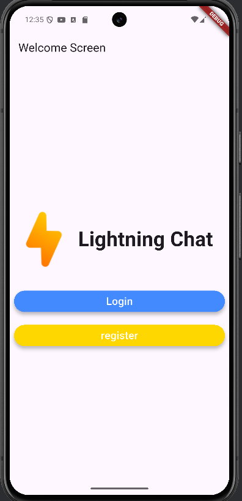
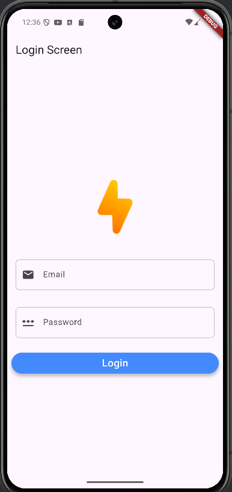
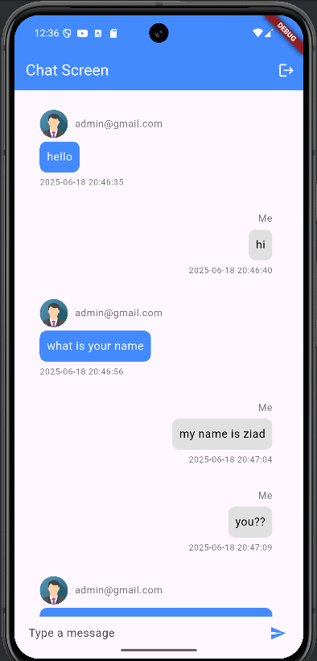

# ⚡ Lightning Chat

[](https://flutter.dev)
[](https://firebase.google.com)

A real-time global chatroom where everyone connects in one lively conversation. Built with Flutter and powered by Firebase for instant messaging.

## 📸 Screenshots

<div align="center">
  
   
</div>

<div align="center">
  
</div>

## ✨ Features

- **Single Global Chatroom** - All users participate in one conversation
- **Firebase Authentication** - Secure email/password sign-up and login
- **Real-Time Messaging** - Instant message syncing with Firestore
- **Clean Minimalist UI** - Focused on the conversation
- **Cross-Platform** - Works on Android, iOS, and web

## 🛠 Tech Stack

- **Frontend**: Flutter (Dart)
- **Backend Services**:
  - Firebase Authentication
  - Cloud Firestore (NoSQL database)
  - Firebase Security Rules
- **State Management**: [Provider/Bloc/Riverpod] *[Choose one]*

## 📋 Prerequisites

- Flutter SDK (latest stable version)
- Firebase account
- Android Studio/Xcode (for mobile development)
- Basic knowledge of Dart and Flutter

## 🚀 Getting Started

### 1. Clone the repository
```bash
git clone https://github.com/yourusername/lightning-chat.git
cd lightning-chat
